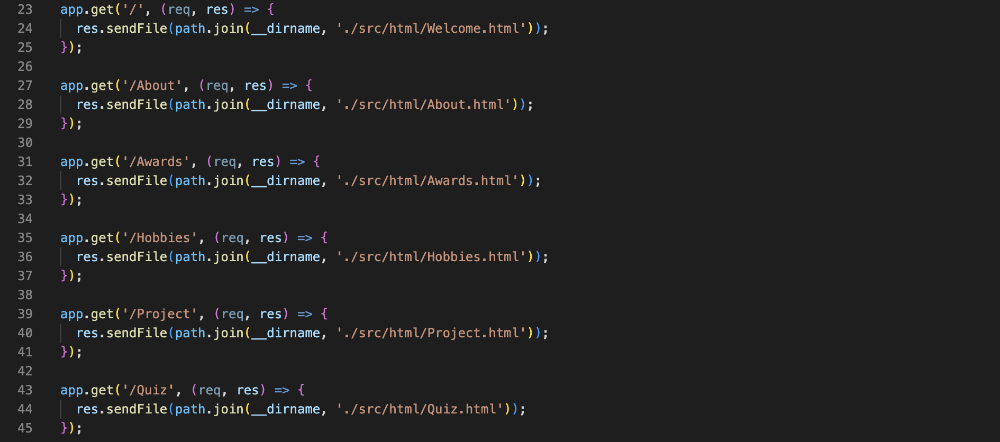

# Web-Develop-Assignment
-----
(If you are in codio, right click on the README.md file above and choose the button "Preview static" to make sure all images and links are displayed as expected)
- School: University of Aberdeen & South China Normal University
- Major: Computer Science
- Name: Zhan Shiquan
- Student Number: 50087448
- Github: https://github.com/Eric030928/Assignment_web

---------
## 1. Run the project

(1) Download the folder on your computer
(2) Open terminal in your computer
(3) Type the commands below one by one 

```
cd Assignment_web 
npm start
```
 
 Notice: 
1. If you download the file and type the commands in your terminal, it will automatically start with your browser and load the file.
2. If you are in codio, please click the 'Box URL' button above after you type the commands in terminal

----
##  2. Structure Overview
### 2.1 File Structure
As shown below, my project contains the following files in this structure:


Among them, main.js is the server-side code of the project and the entry file of the project; package-lock.json and package.json files are the configuration files generated after enabling the node.js service; the src folder contains the html, css,js, figures folder and leaderboard. json file, html contains the structure of each page file, css contains the beautification of each page file, js contains the interactive function code of each page, figures contains some of the images that I use in the whole project, leaderboard.json is stored in Quiz in json format need to store or call the leaderboard data.
### 2.2 Web Structure

----

## 3. Design of the Website
### 3.1 Overview of the website

**(1) For programming (What I used to create the website?):**
For the implementation of the web pages, I used **Hypertext Markup Language (HTML)**, which I learnt in class, to build the structure and content of the web pages, spruced up the appearance of the pages with the help of **Cascading Style Sheets (CSS)**, and used **JavaScript (JS)** to implement the interactive features of the pages. In addition, I used **Node.js** to configure the back-end of the website and employed the **Express** framework and **Fetch API** for routing and test data uploads and calls. Considering my personal high standards and requirements for website customization, I did not use front-end page frameworks such as bootstrap throughout the project and instead used a native web programming language to customize my website.

**(2) For pages (How many pages in my website?) :**
This website mainly consists of six pages, **Welcome page**, **About page**, **Awards page**, **Projects page**,  **Hobbies page** and **Quiz page**.

**(3) For contents (What are concluded in my website?):**
This site contains the following: 
Firstly, my personal profile, which includes **basic information of mine** such as the institution I am attending and my major. 
Secondly, a description of the **honors I have received**, covering competition awards and student work and other honours. 
Thirdly, a description of my **personal hobbies**. 
In addition, the website contains a **description of the projects I have been responsible for or involved in**, which includes the start and end dates of the projects, the project titles, my role, and the specific things I was responsible for in each project.
Also, the website contains **the Quiz section required** by the course.
I will discuss them later respectively in the following content.

**(4) For style of designing the website (What do I do to keep the style of my website consistent?)**
In order to keep my page style consistent and not look and feel too cut off to the user, I chose to use blue as the color base and white and black as the accompanying colors in all of my pages, so you can see that all of my pages are basically in shades of blue. There are two reasons for choosing the blue color: one is that it looks more simple and pleasing to the eye; the other is that I am also better at choosing the background of the page to use as a backdrop to display my content. And, in the choice of background video or image, I focus on choosing mountains, sea or sky which are blue or greenish in color, which can echo with the main color of my webpage and increase the aesthetic effect.
### 3.2 Design of Each Page

#### 3.2.1 Welcome page

**(1) Description**
This page is the first page that appears after launching the project and serves as a portal page to welcome users to my site and make the page more aesthetically pleasing. And the video will start play automatically.

**(2) Design of the page**
The page contains only a background video, an introductory statement "Welcome come to my world" and a sky blue button that says "Learn about me!".

To implement the video, I introduced it into the page via the \<video> tag, set its position to fixed, width and height to 100%, and placed it at the bottom of the page, successfully fixing it in the centre of the page and spreading it across the page.
In the statement and button implementation, I use CSS animation effects, using @keyframes to create animation effects, and animation-name will be the corresponding animation effects into the final presentation of the statement from the right to the left into the buttons from the bottom to the top of the page effect. And, in the implementation of the button, I also added the class to learn the .hover on the mouse over the element to change the appearance, so that the page is more cool and beautiful.
Clicking the button will take you to the About page.

#### 3.2.2 About page

**(1) Description**
This page contains my basic introduction, that is, my name, age, hometown, education, academic background, language grades or certificates obtained, research interests, and email address. This is the first page you go to after clicking the button on the Welcome page. You can navigate to any page on this page by clicking on the content name in the upper navigation bar.

**(2) Design of the page**
On the left side of the page is my profile picture, on the right side is my introductory information, and at the very top of the page is a navigation bar with no border and no background color, so you can click on the name of the corresponding content to go to that page. 

Again, for aesthetic effect, I set an animation effect in the style of the image and the text content box, similar to the implementation of the Welcome page, which ultimately makes both my photo and the content text box float from bottom to top.
And, in the implementation of the navigation bar, I used **.hover** and **text-decoration** to achieve that when the mouse moves over the text, the text turns green and is underlined. The underline is also automatically added below the text when the text is clicked. With this design, you can know the page you are on more clearly and improve the aesthetics of the page at the same time.
In order to focus on the text headings to separate the content, I also used the \<h>, \<strong> and \<em> text tags to achieve content focus.

#### 3.2.3 Awards page

**(1) Description**
This page contains scholarships, competition awards and school honors that I have achieved.

(2) Design of the page

Similarly, at the top of the page I set up a global navigation bar so you can navigate to individual pages. In the text, I used \<strong> and  \<em> to differentiate the text, and I used the unordered list \<ul> that I learned in class to set the formatting for each honor. And, I set the border of the text box to a blue border, white background, using animation effects to achieve the visual effect of floating from right to left, making the page more beautiful.

#### 3.2.4 Hobbies page

**(1) Description**
The page contains my daily hobbies, singing, cooking and traveling. It contains pictures of my various hobbies, including pictures of me performing, cooking, and taking pictures of my travels, and next to the pictures are my feelings and experiences about these hobbies.

**(2) Design of the page**

The navigation bar is set up in the same way as on the previous page, so I won't go into that too much detail here. On this page, in addition to implementing a centered text box with a blue border, as I did on the previous two pages, I also made innovative use of a rotating image to display my photos. Specifically, in the implementation of the rotating image, I used CSS to restrict each slide so that their position is limited to the slide-container, and I also used a Javascript function to make each photo switch every 1 second to ensure that each photo disappears after 2s and the other fades in. You can refer to my code for details:

By using rotating images, my photos don't become redundant or unplaceable, adding to the aesthetic effect to some extent. And, in the text setting, in order to make some space for the rotating image to distribute, I use margin to set the position of the paragraph, so that the paragraph will not be covered by the rotating image.

#### 3.2.5 Projects page

**(1) Description**
This page includes the content of several projects that I have worked on during my school years, specifically when the project started and ended, the name of the project, the role I took on, and what I was primarily responsible for in the project.

(2) Design of the page

The design of this page is relatively simple, and is basically the same as the design and implementation of the Awards page, so I won't go into too much detail here. The only difference is that in the line for the project's start and end times, project name and role, I used **&thinsp** to implement spaces in order to separate the three, successfully creating the effect of spacing.

#### 3.2.6 Quiz page
**(1) Description**
This page is the focal point of the assignment, and I will provide a detailed explanation of its implementation method and specifics.
On the Quiz page, the user is first navigated to the Quiz welcome page:

Before starting the quiz, you need to click the center button "Let's start it" to enter the quiz mode. In my setup, when the user clicks the button, a modal box will pop up first, and the user needs to enter his/her own name, and then click the "Submit In my setup, when user clicks the button, a modal box will pop up first, user need to enter his/her name, then click "Submit" button to go to the next page, otherwise it will pop up a warning to enter your name and can't answer (You can have a try if you are interested in that because I won't show it below):

After clicking the submit button, the user will see a page of sample questions. In fact, this example question is not mandatory in our task, but I put here an example question with no answer detection and no countdown so that the user is fully familiar with my answer page. In the example question, I have explained the content, such as how the question is answered, how long the countdown is, how the time will keep decreasing and what the style of the options are. By having a sample question like this, I think it will help users of the site to quickly understand the process and start answering the questions:

After clicking the "Continue" button below, the user will enter the quiz page without prompting, and the system will automatically start timing the user's quiz time. In order to enhance the fun and excitement of the test, I deliberately chose to set the countdown time to 5 seconds a question, 5 seconds more than the system will pop-up window to inform the user "Time out!", after the user to close the warning, the system will automatically switch to the next question and the question will not be added to the score. Note that even if the user selects an answer, but does not click the submit button, it is still considered time out. There are a total of 10 questions, covering history, math, etc., to fully test the breadth of the user's knowledge.

The user's starting score is 0, after each correct answer, the system will automatically add 1 point for the user; if the answer is wrong, the system will not deduct points, but will not give the user additional points. In other words, the total score is 10 points, and the user will only be awarded points if he/she answers the question correctly.

After answering the 10th question, or after the 10th question timeout, the system will pop-up window to inform the user that the question has been answered, the number of questions answered correctly by the user within 10 questions, and the time from the beginning to the end of the user's answer.

After the 10th question is answered, or after the 10th question has timed out, a pop-up window will appear to notify the user that the question has been answered, the number of questions the user has answered correctly within the 10-question period, and the amount of time that has elapsed from the start to the end of the user's answer. After closing this notification, a "Completed" notification will be sent to remind the user that the question has been completed and the button below will change to "Check the leaderboard". Also, the time will be reset to -1s so that the question timer will not start again.
Moreover, after the 10th question, the user's username, score and time spent on answering the question will be uploaded to the server, which will record the data on the leaderboard, and it will be retrieved when it needs to be called.

After clicking the button, the system will automatically jump to the Leaderboard text box, displaying a table containing each user's username, score, and time spent answering data. The first column is the username, the second column is the score, the third column is the answer time; the number of rows of data represents the ranking of the player, for example, the user "juj" in the third row is ranked No. 3. The table is automatically sorted by Score from highest to lowest, and the one who spends less time will be ranked higher when the Scores are the same. Through the reasonable and clear structure of the table, users can more intuitively see the data of all players and their own rankings, and have a more fresh feeling of competition.

Click the "Close" button below to refresh the site and redirect to the Quiz page. This concludes the process of answering the quiz.

**(2) Design of the front-end**
Firstly, for aesthetics, similar to the Welcome page, I added a portal page to guide the user to the answer screen. I used a modal box instead of a page when answering the questions because I chose to use a modal box to allow the user to answer the questions, considering that jumping between pages can take some time, and if the network signal is poor, it will not ensure a smooth transition between pages. 

Secondly, in terms of styling the options, I didn't choose HTML radio boxes for the options. The reason for this is that the native HTML radio box style is simple and cannot be improved by CSS. Therefore, I chose to use buttons as the style for the options so that my buttons can be highly customized to my needs and the style is much more pleasing to the eye. And, after the option is selected, I also used .selected in CSS to make the selected option darker to enhance its contrast with the other options and help the user to know which option he/she has selected to avoid making a mistake and answering the question incorrectly.

In addition to this, I did not choose to use other methods to display the results in the prompts after each question was answered, but instead chose to display the results in a modal box, which ensured that the user could not move on to the next step without confirming the information.

For the leaderboards, I chose to place the leaderboards in a text box that pops up when the button is clicked, and I implemented this logic in Javascript. And, in the button and text setup, I did the same to hide and show the buttons, i.e. changing from **display:none** to **display:block**, or selecting the corresponding element using **document.getElementById** and changing it between the current pages using **.innerHTML**. Specifically, I bind what I want to show next to a Javascript function that ensures that when that function executes, the elements I want to make disappear will be hidden and the elements I want to make appear will be shown. By switching between elements in this flexible way, I keep the page looking clean, and the user doesn't have to spend time on network signals, which can lead to inefficiencies and poor user interaction.


**(3) Design of the back-end**
This section, which is also about how the quiz application client side communicates with the server, with respect to handling events.

1. What I used?
Firstly, considering the need to interact with data server-side, I configured the node.js environment in my project using the command npm init so that Javascript could run server-side. In addition to that, considering the transfer and fetching of data, I also used the **Express** framework that I learnt in class for the back-end routing settings. And, since my project is not deployed on a server or connected to a database, I chose to store the leaderboard data in the leaderboard.json file to simulate a server-side database. And in this step, since I need to use Javascript to access the file data, I used **Fetch API** for file access.

2. How did I make the quiz application client side sends the data to server side and store it in the file?
Firstly, I used npm init to configure my node.js environment and make sure that the Javascript code on the server side would work.

Secondly, I created a main.js file in the root directory as the entry file for my project, which means that if I want to start the whole project, I just need node main.js to start the whole project. So after creating the file, I am going to modify it.

Specifically, I started by importing my installed libraries or packages in the file, both express, body-parser, path, fetch API for subsequent use. And, I also set the port number to 5500, made basic configurations to the project, such as introducing libraries for parsing files in json format, setting the file directory paths for the view files, etc., so I won't overdo it in this section.

Next, I used the get method to set up the routes so that the user can receive the web files I transferred when the client enters the corresponding route of the website.

As mentioned earlier, the user needs to upload the user's username, score and answer time after answering the question, in this step, I used the fetch API to send a POST request to the server's logic in the logic after the user has finished answering the question in Quiz.js, and set up the data objects to be passed in.

At the same time, I also introduced the fetch API in the server-side code to receive client-initiated requests, set the method to POST, and re-store the received data into a new array, and after storing it, re-write that array to the leaderboard.json file.
After this step, I have implemented the operation of uploading the answer data from the client to the server.

3. How did I make the quiz application server side sends the data to client side and show it into the table?
In this step, I have used a GET request for the client to initiate the data request, with a syntax structure similar to POST. 

And I have added code on the server side to respond to the GET request by reading the server side leaderborder.json file and transferring the data to the user side. After this, I add data processing logic in the client side Javascript code so that the client side processes the data after accepting it and displays the data in the form.

With that, I implemented server-side and client-side data transfer through the Express framework and the Fetch API.

-------
## 4. Challenges

### 4.1 The achievement of  CSS animation
Because the content of the class does not involve too much CSS animation content, and in the implementation of my website, I need to achieve the elements of the offset, such as elements from the bottom to the top of the movement, but also to use Javascipt code to achieve the style of rotating chart changes, but before this I do not have the relevant knowledge base, which is a greater challenge for me. So, in order to achieve the animation effect and rotating chart style I need, fortunately, there are more related materials on the Internet, so I can search for related materials on the Internet and learn, but also according to the reference tutorials to improve, and finally achieve the expected animation effect and rotating chart style. These references are mentioned in the following "References".

### 4.2 The achievement of  Quiz's answer page
At the beginning of implementing Quiz, I didn't consider the page transition, so when I tried to jump to the next page for the next question after the user clicked the button, I found that the transition was slow and I couldn't avoid the lag when loading a new page. In addition to this, the pre-determined nature of the questions and correct answers made it difficult to know where to start, and I spent a lot of ineffective time on this section and could never find an alternative. After repeatedly reviewing the courseware for the class, I was inspired by the courseware involving Javascript and HTML, and gathered information online to supplement my knowledge.

That is to say, through the use of Javascript's DOM operations, I realised that a modal box appears after the user clicks on the answer button, and every time the button is clicked, each element of the modal box is obtained and the text value of each element is changed, and finally the function that the question can be automatically switched to the next question in the current page after clicking on submit is realised, which avoids the loading of a new page, avoiding the lag of loading a new page. Moreover, I used what I learnt from the class to create an array using Javascript to store the predefined questions and correct answers, and then use a loop to assign values to the new questions and correct answers to the new questions.

### 4.3 The achievement of the data transfer between server-side and client-side 
For me, this part is the biggest challenge of this project. When implementing the uploading of user answer data and the fetching of leaderboard data, I was clueless at first. Even though I had learnt about it in class, the back-end was not as easy to understand as the front-end, which led me to be unsure of how to design the transfer of data in the beginning. Even though Socket.IO was something we covered in class, it was a little difficult for me to understand it, so I didn't use it in my implementation, but it did give me an understanding of how the server-side and client-side interact with each other. Fortunately, at least in class I learnt about the Express framework and how to configure the server side with it, so I used the Express framework to initially implement the most basic site hopping.

Combined with what we are trying to achieve, after searching for relevant information on the Internet, I decided to use the Fetch API with Express to interact with the data, and use a .json file on the server side to store the chart data. Specifically, when the client initiates a data request, I use the Fetch API on the server side to receive the client's request and read the .json file on the server side. After reading the file, I process the data in the file logically, and then send it to the client after processing. Fortunately, with this cooperation, I successfully achieved the data transfer.

----
## 5. Future Plan and Improvement
### 5.1 Deploying the website to the server
Although I have now implemented a more aesthetically pleasing and functional personal website, I have only been able to deploy it locally and have not deployed the project to run on a server. This may be enough for an assignment, but it's not enough effort for someone who wants to get into real project development. So in the next phase, I will explore how to deploy my website on a cloud server.
### 5.2 Using a database to store leaderboard data
Because the current data storage is done through .json files, which is not secure enough, after considering the security of the website, I plan to use MongoDB, which I learnt from the class, as my database to store the relevant data after deploying the cloud server.
### 5.3 Functionality improvement and page beautification
In the subsequent improvement, I plan to add some other features, such as users can register on my website and initiate question-answer battles online, that is, users can answer questions in real time and enhance the sense of achievement for them through certain promotion mechanisms. In addition, I also plan to increase the number and type of questions in the question bank, and divide them into difficulty types or knowledge types so that users can independently choose their own areas of interest and difficulty of the questions, so as to enhance the user's sense of use of the product. Moreover, I also plan to add a comment section to my website for visitors to give feedback on my website to provide suggestions for improvement, which will help me to improve the website. Apart from that, proper page beautification is also essential to attract users to my website.

-----
## 6. References

1. https://developer.mozilla.org/zh-CN/docs/Web/CSS/CSS_Animations/Using_CSS_animations 
   I have learnt the basics of how to use CSS animation to the fullest in this site and learnt how to apply it on my website.
2. https://pixabay.com/zh/photos/
   The background images on my website, i.e. the mountains, oceans and skies, were downloaded from this website, which provides free downloadable resources and the right to use them, so I will not be infringing.
3. https://blog.csdn.net/m0_48375854/article/details/122125100
   This site taught me how to use rotating images on my own site, but its a manual rotation and didn't work for the style I wanted, so I modified this tutorial to finally implement a rotating image that scrolls automatically.
4. https://cloud.tencent.com/developer/article/2411958
   This site taught me how to use the Express backend and the Fetch API for front-end and back-end data transfer. Although the tutorial was relatively simple, it did provide me with some basic ideas for subsequent improvements.
5. https://www.w3school.com.cn
   This site is a basic tutorial for web development, providing tutorial documentation on all the basic usage, and whenever I come across a syntactic structure that is unclear or I'm not sure how to spruce up a page, this is the first place I look for some inspiration.

